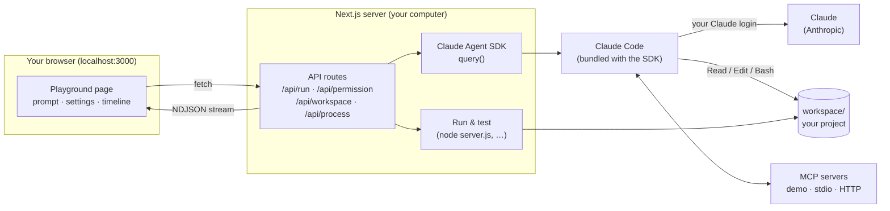
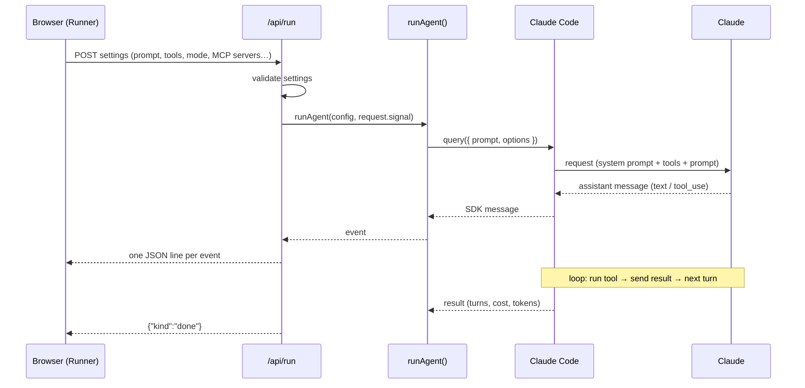
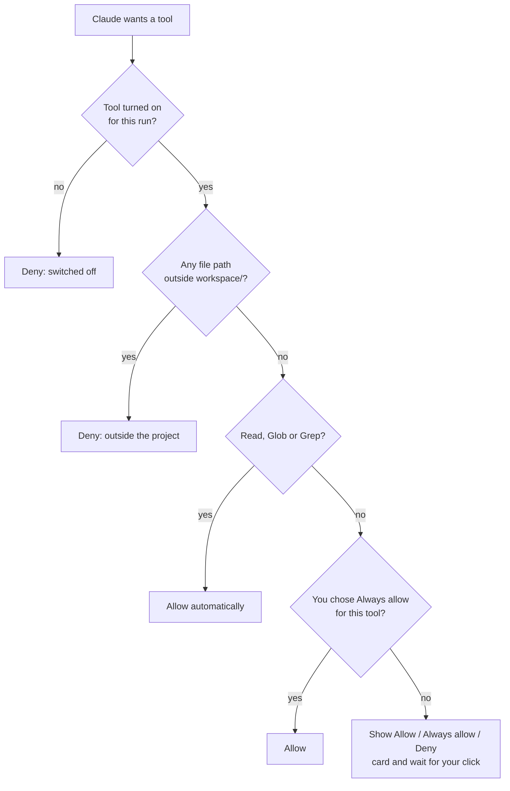

# How the playground works

This guide explains what happens behind the scenes when you click **Run**: how the playground talks to Claude without an API key, how permissions and MCP servers work, and how starter projects are created, run and tested.

For setup and usage, see the main [README](../README.md).

---

## The big picture

The playground is a [Next.js](https://nextjs.org) app that runs on your computer. The browser page is the user interface. The Next.js server does the real work: it uses the **Claude Agent SDK** to run Claude Code, and streams everything that happens back to the page.



| Layer | What it does | Main files |
|---|---|---|
| Browser page | Examples sidebar, prompt, Settings / MCP / Code tabs, live timeline, Workspace panel | `src/components/Playground.tsx`, `Runner.tsx`, `Timeline.tsx` |
| API routes | Start runs, answer permission prompts, manage the workspace and programs | `src/app/api/*/route.ts` |
| Agent SDK | Runs the Claude Code agent loop and yields messages | `src/lib/run-agent.ts` |
| Claude Code | The agent itself: talks to Claude, runs tools, loads CLAUDE.md, connects MCP servers | shipped inside `@anthropic-ai/claude-agent-sdk` |
| Workspace | The project Claude works on, created from a starter | `workspace/`, `templates/`, `src/lib/workspace.ts` |

---

## 1. No API key: how authentication works

The Agent SDK does not call the Claude API itself. It starts the **Claude Code program** (a binary bundled with the SDK package) and talks to it over stdin/stdout. Claude Code signs in the same way it does in your terminal: with the login you created by running `claude` and signing in.

The playground makes sure that login is used:

- It **removes `ANTHROPIC_API_KEY`** from the environment it passes to Claude Code (`src/lib/run-agent.ts`), so a key in your shell is never used by accident.
- The **Session started** card shows the SDK's `apiKeySource`. `none` means "no API key; using your Claude login", and the card says so in plain words.

**Checking the login without spending anything.** `src/lib/account.ts` starts a query with a prompt stream that never sends a message, and asks Claude Code for `accountInfo()`. No model call happens, so it costs nothing. The result powers:

- the **Signed in** badge in the header and the "Claude isn't ready yet" banner (`src/components/SetupStatus.tsx`, via `GET /api/status`)
- the check that runs before `npm run dev` (`scripts/check-setup.mjs`)

> Signing in with your Claude account is fine for learning on your own computer. An app you build for other people should use its own API key.

---

## 2. What happens when you click Run



1. **The browser sends your settings.** `Runner.tsx` posts the whole `RunConfig` (see `src/lib/run-types.ts`) to `/api/run`.
2. **The route validates them.** Unknown tools, permission modes or bad MCP server entries are rejected with a 400 (`src/app/api/run/route.ts`).
3. **`runAgent()` builds the SDK options** (`src/lib/run-agent.ts`):

   | Setting in the UI | Agent SDK option |
   |---|---|
   | Model | `model` |
   | Permission mode | `permissionMode` |
   | Built-in tools | `tools` (only these tools exist for the run) |
   | Max turns / Spending cap | `maxTurns` / `maxBudgetUsd` |
   | Append to system prompt | `systemPrompt: { type: "preset", preset: "claude_code", append }` |
   | Load CLAUDE.md | `settingSources: ["project"]` (otherwise `[]`) |
   | MCP servers | `mcpServers` (+ `strictMcpConfig: true`) |
   | Subagents / review team | `agents` (+ the `Agent` tool) |
   | Hooks | `hooks` |
   | Allow / Deny cards | `canUseTool` |

   It always sets `cwd` to `workspace/`, `settingSources: []` unless you ask for CLAUDE.md, and `strictMcpConfig: true`. Together these mean your personal `~/.claude` settings and MCP servers never leak into a run, so everyone gets the same results.

4. **Messages stream back as NDJSON.** `query()` yields SDK messages (`system` init, `assistant`, `user` tool results, `result`, and some bookkeeping). The route wraps each one as `{"kind":"sdk","message":…}` and writes one JSON object per line. The browser reads the stream line by line and appends each event to the timeline.
5. **Side events are merged into the same stream.** Permission prompts, auto-decisions and hook calls happen inside callbacks, not as SDK messages. `runAgent()` queues them and races the next SDK message against new side events, so everything arrives in order in one stream.
6. **Stopping.** The **Stop** button aborts the browser's fetch. The route's `request.signal` fires, which aborts the SDK's `AbortController` and shuts Claude Code down.

**The timeline** (`src/components/Timeline.tsx`) turns raw messages into cards: `system/init` → **Session started**, `text` → 💬, `tool_use` → 🔧, `tool_result` → 📄, `result` → **Done** (turns, time, estimated cost, tokens). **Show raw messages** shows the exact JSON your own code would receive.

**Follow-ups.** Every SDK message carries a `session_id`. The browser keeps the one from the first run, and each follow-up sends it back as `resumeSessionId`, which becomes the SDK's `resume` option: Claude Code reloads the earlier turns of that session, so Claude remembers the conversation. Settings can change between turns. **＋ New conversation** simply forgets the id; switching or resetting the workspace does too, because the old conversation was about other files. The page shows the conversation as turns (your prompt, then its timeline), and the Code tab adds `resume: "<id>"`. Runs also pass `settings: { autoMemoryEnabled: false }`, so Claude Code keeps no memory files between separate conversations.

**Error results.** When a run hits the spending cap or the turn limit, the SDK sends a `result` with `error_max_budget_usd` / `error_max_turns` and then throws. `runAgent()` ignores that throw after a result has arrived, so you see one clear card instead of two.

---

## 3. Permissions: the Allow / Deny cards

Claude never touches your computer directly. It asks Claude Code to run a tool, and Claude Code asks the playground's **`canUseTool`** callback whenever a tool isn't pre-approved.



How the wait works:

1. `canUseTool` creates an id, stores a pending promise in a map, and emits a `permission_request` event, which shows the amber card.
2. Your click sends `POST /api/permission { id, allow, always }`.
3. `answerPermission()` resolves the promise, and Claude Code continues (or tells Claude it was denied).

Things to know:

- **Permission modes still apply first.** In `acceptEdits` mode Claude Code approves file edits inside the workspace itself, so no card appears. In `plan` mode nothing is changed. In `dontAsk` anything not pre-approved is denied without asking.
- **Claude Code has its own read-only allowlist.** Simple commands like `ls` can run without a card when Bash is on.
- **The demo MCP server's tools are pre-approved** (`allowedTools`), so they skip `canUseTool`. Tools from MCP servers you add always ask.
- **Hooks run before permissions.** A `PreToolUse` hook that returns `deny` blocks the tool whatever the permission mode says.

---

## 4. Hooks and subagents

**Hooks** (`hooks` in `run-agent.ts`) are plain functions the SDK calls at points in the loop:

- With **Hooks** turned on, `PreToolUse` and `PostToolUse` hooks log every tool call (purple 🪝 cards), and the `PreToolUse` hook **denies any Edit or Write to `README.md`**.
- Whenever subagents are on, another `PreToolUse` hook sets `run_in_background: false` on every `Agent` call. Claude Code normally runs subagents in the background, which would end the turn before their reports came back. Forcing the foreground keeps the timeline in order. Several `Agent` calls made in the same turn still run in parallel.

**Subagents** are `AgentDefinition`s passed in `options.agents`:

- `code-reviewer`: one read-only reviewer on Haiku
- the review team for orchestration: `bug-hunter`, `readability-reviewer` and `test-designer`

The timeline links each subagent's messages to the `Agent` call that started it (`parent_tool_use_id`) and gives each subagent its own colored tag.

---

## 5. MCP servers

A run can connect to three kinds of MCP servers at once:

| Kind | Where it runs | How it's configured |
|---|---|---|
| **Built-in demo** (`demo`) | inside the Next.js process | `createSdkMcpServer()` + `tool()` in `src/lib/demo-mcp.ts` (dice, fake weather, notes) |
| **stdio** (e.g. Memory, your own) | a program Claude Code starts on your computer | `{ type: "stdio", command, args }` |
| **HTTP** (e.g. DeepWiki, Context7) | a server on the internet | `{ type: "http", url }` |

- **Adding servers.** The MCP servers tab (`src/components/McpPanel.tsx`) keeps your servers in `RunConfig.mcpServers` and remembers the ones you add in your browser (`src/lib/saved-mcp.ts`). The server re-checks every entry (`validateMcpServers()` in `run-types.ts`): names must be lowercase, URLs must be `http(s)`, at most 8 servers.
- **Test connection** (`POST /api/mcp-test`, `src/lib/mcp-test.ts`) uses the same no-prompt trick as the login check. It starts Claude Code with only those servers, polls `mcpServerStatus()` until each one is `connected` or `failed`, and returns each server's tools. No model call, so it costs nothing.
- **Tool names** follow Claude Code's pattern `mcp__<server>__<tool>`, e.g. `mcp__deepwiki__ask_wiki_question`.

---

## 6. The workspace and starter projects

Claude always works in **`workspace/`**. It's ignored by the playground's own git repo and created from a **starter** in `templates/`:

| Starter | Folder | Scripts it can run |
|---|---|---|
| Tiny Shop | `templates/tiny-shop/` | `node --test` |
| REST API | `templates/rest-api/` | `node server.js` (long-running), `node --check server.js` |
| MCP server | `templates/mcp-server/` | `node --check server.js` |
| Agent SDK script | `templates/agent-sdk/` | `node agent.mjs`, `node --check agent.mjs` |

The list lives in `src/lib/templates.ts`.

**Creating a workspace** (`src/lib/workspace.ts`):

1. Delete `workspace/`, then copy the starter's folder in.
2. Write `.playground-template` to remember which starter it came from.
3. **Make it its own git repo** with one commit, "Starting point". Claude Code puts `git status` into Claude's context. Without its own repo, the workspace would show the playground's files (`../src`, `../package.json`) and Claude would wander there.

**Why starters need no `npm install`.** `workspace/` sits inside the playground folder, so Node finds packages in the playground's `node_modules`: `@modelcontextprotocol/sdk`, `zod` and `@anthropic-ai/claude-agent-sdk`. Each starter's `CLAUDE.md` tells Claude not to install anything.

**Switching keeps your work.** `POST /api/workspace { template }` moves the current `workspace/` into `.workspaces/<starter>/` (git-ignored) and moves the target starter's parked folder back, or creates it fresh the first time. Files and git history survive the round trip; `GET /api/workspace` lists parked starters so the picker can mark them "saved". `DELETE /api/workspace` **resets** the current starter to its original files, which is the one action that discards work. Both stop any running program first. An example that needs a particular starter (`template` in `src/lib/examples.ts`) shows a **Switch to …** banner when your workspace has a different one.

**Changes** (`GET /api/workspace/diff`, `workspaceDiff()`): runs `git add --intent-to-add --all` (so new files show up) and `git diff HEAD` inside the workspace, splits the output per file, and the Changes tab colors added and removed lines.

**Download** (`GET /api/workspace/download`): zips every file except `.git`, `node_modules` and the playground's marker, using a small built-in ZIP writer (`src/lib/zip.ts`, deflate via `node:zlib`, no extra packages).

---

## 7. Run & test

The **Run & test** tab (`src/components/RunPanel.tsx`) runs your project without leaving the page.

**Running scripts** (`src/lib/processes.ts`, `/api/process`):

- Only the scripts a starter declares can run: the request names a script id like `start`, never a command, so there is no way to run arbitrary shell commands.
- One program at a time. Starting another one stops the current one first.
- It runs inside `workspace/` with `PORT=4100`, and without `ANTHROPIC_API_KEY`, so agent scripts use your login too.
- Output is kept (last 400 lines), and the panel polls `GET /api/process` every second while it's running.
- **Stop** sends SIGTERM, then SIGKILL after 3 seconds. Running programs are also stopped when the playground exits.

**Request tester** (REST API starter; `/api/process/request`): sends one request from the server to `http://127.0.0.1:4100<path>`. The host and port are fixed, and the path must start with a single `/`, so it can only reach your own API. It shows the status, the time taken and the pretty-printed JSON body. "Connection refused" becomes "Click Start server first."

**Connect to the playground** (MCP server starter): adds `{ name: "my-server", type: "stdio", command: "node", args: ["server.js"] }` to the run's MCP servers. Claude Code starts it inside `workspace/` on every run, so your latest code is always used.

---

## 8. Security model

The playground can edit files and run programs on your computer, so it's locked down in layers:

| Layer | Protection | Where |
|---|---|---|
| Network | The server listens on `127.0.0.1` only, so other devices on your network can't reach it | `package.json` (`--hostname 127.0.0.1`) |
| Every API route | `Host` must be localhost (blocks DNS rebinding); an `Origin`, when present, must match (blocks other websites); POSTs must be JSON (forces a CORS preflight) | `src/lib/local-only.ts` |
| Files | Tool paths outside `workspace/` are denied | `canUseTool` in `run-agent.ts` |
| Actions | Edits, commands and your MCP tools wait for your click | `canUseTool` |
| Programs | Run & test runs only declared starter scripts | `processes.ts` |
| Requests | The request tester only reaches `127.0.0.1:4100` | `processes.ts` |
| Config | Your `~/.claude` settings and MCP servers are ignored | `settingSources`, `strictMcpConfig` |
| Spend | Every run has a spending cap ($1 by default) | `maxBudgetUsd` |

What it does **not** protect against: code **you** approve or run. A server Claude writes, an MCP server you add, or a Bash command you allow runs with your user's permissions. Read what you approve.

---

## 9. Browser-only state

Some preferences are kept in your browser's `localStorage`, for this browser only:

| What | Key | File |
|---|---|---|
| Examples you've run successfully (✓) | `claude-code-playground:tried:v1` | `src/lib/tried.ts` |
| MCP servers you added | `claude-code-playground:mcp-servers:v1` | `src/lib/saved-mcp.ts` |

The current conversation (its session id and turns) lives only in the page: reloading the page starts a new conversation. Claude Code itself keeps session transcripts in `~/.claude/projects/`, as it does in the terminal.

If storage is blocked (private windows, strict settings), everything still works; these just aren't remembered.

---

## 10. Where to change things

| I want to… | Edit |
|---|---|
| Add an example to the sidebar | `src/lib/examples.ts` (then `npm run check:examples`) |
| Add a starter project | a folder in `templates/` + an entry in `src/lib/templates.ts` |
| Add a quick-add MCP server | `MCP_PRESETS` in `src/lib/run-types.ts` |
| Add a demo MCP tool | `src/lib/demo-mcp.ts` |
| Change what's allowed without asking | `canUseTool` in `src/lib/run-agent.ts` |
| Change hooks or subagents | `hooks`, `SUBAGENTS`, `TEAM` in `src/lib/run-agent.ts` |
| Change how a message is displayed | `src/components/Timeline.tsx` |
| Change the generated code in the Code tab | `src/components/CodePreview.tsx` |
| Change the Changes diff view | `src/components/ChangesView.tsx`, `workspaceDiff()` in `src/lib/workspace.ts` |

**Checks** (the same ones CI runs on every push, `.github/workflows/ci.yml`):

```bash
npm run lint
npx next typegen && npx tsc --noEmit
npm run check:examples
npm run build
```
