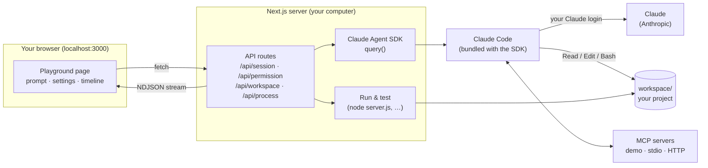
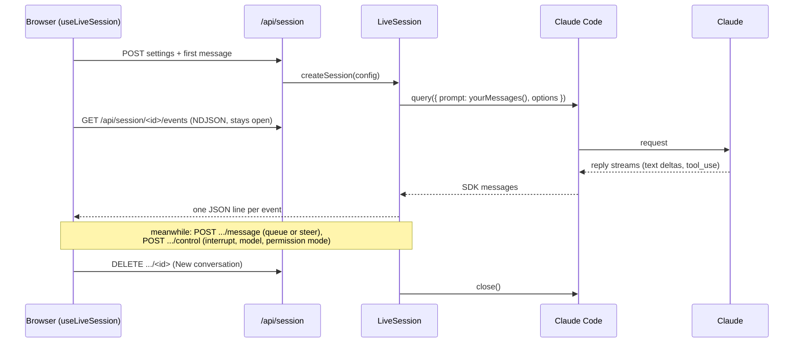
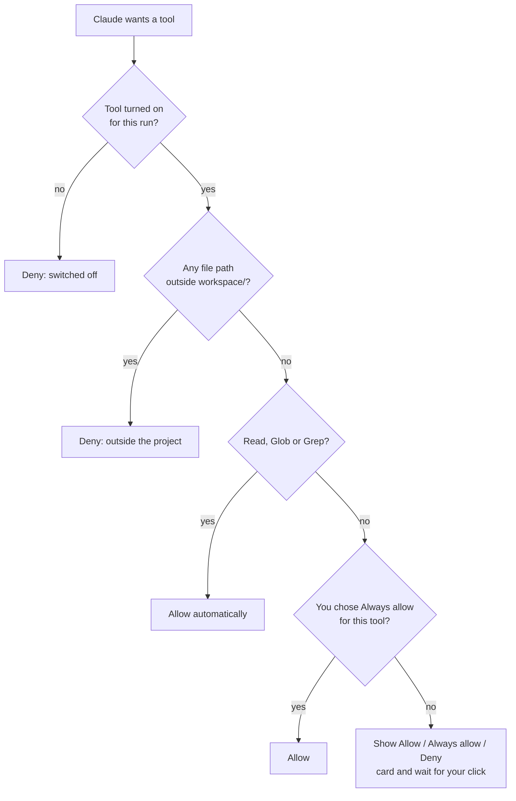

# How the playground works

This guide explains what happens behind the scenes when you click **Run**: how the playground talks to Claude without an API key, how permissions and MCP servers work, and how starter projects are created, run and tested.

For setup and usage, see the main [README](../README.md).

---

## The big picture

The playground is a [Next.js](https://nextjs.org) app that runs on your computer. The browser page is the user interface. The Next.js server does the real work: it uses the **Claude Agent SDK** to run Claude Code, and streams everything that happens back to the page.



| Layer | What it does | Main files |
|---|---|---|
| Browser page | Examples sidebar, prompt, Settings / MCP / Code tabs, live timeline, Workspace panel | `src/components/Playground.tsx`, `Runner.tsx`, `Timeline.tsx` |
| API routes | Start runs, answer permission prompts, manage the workspace and programs | `src/app/api/*/route.ts` |
| Agent SDK | Runs the Claude Code agent loop and yields messages | `src/lib/run-agent.ts` |
| Claude Code | The agent itself: talks to Claude, runs tools, loads CLAUDE.md, connects MCP servers | shipped inside `@anthropic-ai/claude-agent-sdk` |
| Workspace | The project Claude works on, created from a starter | `workspace/`, `templates/`, `src/lib/workspace.ts` |

---

## 1. Signing in: login, API key, cloud provider or practice mode

The Agent SDK does not call the Claude API itself. It starts the **Claude Code program** (a binary bundled with the SDK package) and talks to it over stdin/stdout. Claude Code signs in the same way it does in your terminal. Everything that starts Claude Code or your agent scripts gets its environment from `claudeEnv()` in `src/lib/auth.ts`:

| Mode | How you choose it | What Claude Code gets |
|---|---|---|
| **Login** (default) | nothing | your environment **without** `ANTHROPIC_API_KEY`, so Claude Code uses the `claude` login and a key in your shell is never billed by accident |
| **API key** | `PLAYGROUND_AUTH=api-key` in `.env.local` | your environment **with** `ANTHROPIC_API_KEY` |
| **Cloud provider** | Claude Code's provider variables (for example `CLAUDE_CODE_USE_BEDROCK=1`) | passed through as-is; Claude Code signs in with the provider's credentials |
| **Practice mode** | none of the above works | the page switches off running prompts; everything else works |

The **Session started** card shows the SDK's `apiKeySource` (`none` means "no API key; using your Claude login").

**Failing fast.** With a bad key, Claude Code would retry the rejected request with backoff for about three minutes. So the playground checks keys up front with one free call (`models.list` through the official Anthropic SDK, no tokens), and a live session stops at the first `api_retry` whose error is `authentication_failed` (or status 401), with advice for the mode you're in (`signInHelp()`).

**Checking without spending anything.** `getAccountStatus()` in `src/lib/account.ts` returns `{ ready, mode, label }` or `{ ready: false, reason }`. In login mode it starts a query with a prompt stream that never sends a message and asks Claude Code for `accountInfo()` (a non-`firstParty` `apiProvider` means a cloud provider is set up). In API-key mode it lists models with the key. Neither uses tokens. The result powers:

- the badge in the header and the **practice mode** banner, with **I've set it up: check again** (`src/components/SetupStatus.tsx`, via `GET /api/status`)
- the check that runs before `npm run dev` (`scripts/check-setup.mjs`)

> Signing in with your Claude account is fine for learning on your own computer. An app you build for other people should use its own API key.

Checks for challenges (`challenge-checks.ts`) always run your programs without any key, because they never need Claude.

---

## 2. Live sessions: what happens when you click Run

Each conversation is **one live Claude Code session**, like a terminal session. The first **Run** starts it; after that you can send messages at any time, even while Claude is working, stop the current turn, and change the model or permission mode without restarting.



1. **Starting.** `POST /api/session` validates your settings (`parseRunConfig()` in `src/lib/run-types.ts`) and calls `createSession()` (`src/lib/live-session.ts`). The session builds the SDK options with `buildOptions()` (`src/lib/run-agent.ts`) and starts `query()` in **streaming-input mode**: the prompt is an async generator of your messages, so the session stays open between them.

   | Setting in the UI | Agent SDK option | Changes mid-session? |
   |---|---|---|
   | Model | `model` | yes: `query.setModel()` |
   | Permission mode | `permissionMode` | yes: `query.setPermissionMode()` |
   | Built-in tools | `tools` (only these tools exist) | new conversation |
   | Max turns / Spending cap | `maxTurns` / `maxBudgetUsd` (for the whole conversation) | new conversation |
   | Append to system prompt | `systemPrompt: { type: "preset", preset: "claude_code", append }` | new conversation |
   | Project config | `settingSources: ["project", "local"]` (otherwise `[]`) | new conversation |
   | MCP servers | `mcpServers` (+ `strictMcpConfig: true`) | new conversation |
   | Subagents / review team | `agents` (+ the `Agent` tool) | new conversation |
   | Hooks | `hooks` | new conversation |
   | Allow / Deny cards | `canUseTool` | |

   It always sets `cwd` to `workspace/`, `strictMcpConfig: true`, `includePartialMessages: true` (word-by-word replies) and `includeHookEvents: true`. When you change a "new conversation" setting during a session, the composer says so and offers to start one.

2. **Events.** `GET /api/session/<id>/events?from=<seq>` streams NDJSON. Every stored event has a `seq` number; if the connection drops, the browser (`src/components/useLiveSession.ts`) reconnects with the next `seq` and the server replays what it missed. Word-by-word `stream_event` deltas are sent live only (not stored), because the full message follows. Events include the SDK's own messages (`{"kind":"sdk"}`), your messages (`user_prompt`), permission cards and decisions, hooks, control notes (`control`) and `closed`.

3. **Sending while Claude works.** `POST /api/session/<id>/message { text, how }` adds your message to the input stream:
   - **Queue** (default): it waits until the current task finishes, then runs.
   - **Steer**: it is sent with `priority: "now"`, so Claude Code ends the current task and answers this instead. The page files the interrupted task's result under the turn it belongs to.

4. **Stop** (`POST .../control { action: "interrupt" }`) calls `query.interrupt()`: the current turn ends with an `error_during_execution` result (shown as **Stopped by you**) and the session stays open for your next message, like pressing Esc in the terminal.

5. **Ending.** **＋ New conversation**, switching or resetting the workspace, leaving the example, or closing the tab (`navigator.sendBeacon` to `.../close`) closes the session and its Claude Code process. The server also closes sessions nobody is watching once nothing has happened for 15 minutes, and keeps at most three sessions at a time, closing the oldest.

**Why "Claude is working"?** The page counts your messages against `result` messages: while some message has no result yet, Claude is working. The SDK marks each finished message with a `result`, including interrupted and steered ones.

**The timeline** (`src/components/Timeline.tsx`) turns raw messages into cards: `system/init` → **Session started** (a one-line note on later messages), streaming text → a live 💬 card, `text` → 💬, `tool_use` → 🔧, `tool_result` → 📄, `result` → **Done** (turns, time, estimated cost, tokens). **Show raw messages** shows the exact JSON your own code would receive.

**No memory files.** Sessions pass `settings: { autoMemoryEnabled: false }`, so Claude Code keeps no memory between separate conversations: a conversation remembers only its own messages.

---

### Inside the session: context, tasks, questions and plans

The playground shows the parts of the harness you'd see in the terminal:

| What you see | Where it comes from |
|---|---|
| **Context meter** in the conversation header: how full the context window is, what's using it, and where auto-compaction kicks in | `GET /api/session/<id>/context` → `query.getContextUsage()` (the data behind `/context`), refreshed after every reply |
| **🗜 Compact now** and the **Context compacted** card | sends `/compact` as a message; Claude Code answers with a `system` message `compact_boundary` (`trigger`, `pre_tokens`, `post_tokens`) |
| **Claude's task list** above the prompt box (○ to do, ● in progress, ✓ done) | the `TaskCreate` / `TaskUpdate` tool calls, rebuilt by `taskListFrom()` in `src/lib/tasks.ts`; they're allowed without asking because they touch no files |
| **❓ Question cards**: pick an option or type your own answer | Claude calls `AskUserQuestion`; `canUseTool` shows the card and returns your picks as the tool's `answers` |
| **📋 Plan review** in `plan` mode: approve (auto-accept edits or ask before edits) or keep planning with feedback | Claude writes its plan to `.claude/plans/` (the `plansDirectory` setting) and calls `ExitPlanMode`; approving returns `updatedPermissions: [{ type: "setMode", mode }]`, keeping planning denies with your feedback (or `interrupt: true` without feedback, so Claude stops and waits) |

These tools (`TaskCreate`, `TaskUpdate`, `TaskList`, `TaskGet`, `AskUserQuestion`, `ExitPlanMode`) are always available, like in the terminal (`HARNESS_TOOLS` in `run-types.ts`). Your answers to all cards go through `POST /api/permission` and are checked by `parseAnswer()`.

---

## 3. Permissions: the Allow / Deny cards

Claude never touches your computer directly. It asks Claude Code to run a tool. Before anything else, the playground's always-on **workspace guard** hook checks the call; then Claude Code applies permission modes and rules; and whenever a tool still isn't approved, it asks the playground's **`canUseTool`** callback.

**The workspace guard** (`guardTool()` in `src/lib/permissions.ts`, registered as a `PreToolUse` hook on every run) can't be switched off. Because hooks run before permission rules, it holds even when an allow rule in `.claude/settings.local.json` would skip `canUseTool`:

- a file path outside `workspace/` is **denied**. Paths are compared by their real location (symlinks followed), so `/var` vs `/private/var` aliases still match and a symlink pointing out of the workspace doesn't count as inside;
- an `Edit`/`Write` to `.claude/settings.json` or `.claude/settings.local.json` returns **ask**, so it always shows a card (even in `acceptEdits`), because those files can grant permissions and run shell commands.

Then `canUseTool` decides the rest:



How the wait works:

1. `canUseTool` creates an id, stores a pending promise in a map, and emits a `permission_request` event, which shows the amber card.
2. Your click sends `POST /api/permission { id, allow, always }`.
3. `answerPermission()` resolves the promise, and Claude Code continues (or tells Claude it was denied).

Things to know:

- **Permission modes still apply first.** In `acceptEdits` mode Claude Code approves file edits inside the workspace itself, so no card appears. In `plan` mode nothing is changed. In `dontAsk` anything not pre-approved is denied without asking.
- **Claude Code has its own read-only allowlist.** Simple commands like `ls` can run without a card when Bash is on.
- **The demo MCP server's tools are pre-approved** (`allowedTools`), so they skip `canUseTool`. Tools from MCP servers you add always ask.
- **Hooks run before permissions.** A `PreToolUse` hook that returns `deny` blocks the tool whatever the permission mode says.
- **With project config on, `.claude/` rules apply too** (see section 5): deny rules block, allow rules in `settings.local.json` approve without a card.

---

## 4. Hooks and subagents

**Hooks** (`hooks` in `run-agent.ts`) are plain functions the SDK calls at points in the loop:

- With **Hooks** turned on, `PreToolUse` and `PostToolUse` hooks log every tool call (purple 🪝 cards), and the `PreToolUse` hook **denies any Edit or Write to `README.md`**.
- Whenever subagents are on, another `PreToolUse` hook sets `run_in_background: false` on every `Agent` call. Claude Code normally runs subagents in the background, which would end the turn before their reports came back. Forcing the foreground keeps the timeline in order. Several `Agent` calls made in the same turn still run in parallel.

**Subagents** are `AgentDefinition`s passed in `options.agents`:

- `code-reviewer`: one read-only reviewer on Haiku
- the review team for orchestration: `bug-hunter`, `readability-reviewer` and `test-designer`

The timeline links each subagent's messages to the `Agent` call that started it (`parent_tool_use_id`) and gives each subagent its own colored tag.

---

## 5. Claude Code config: the `.claude/` folder

With **Project config** on (a checkbox in Settings and in the Workspace panel's **Claude config** tab), a run loads the workspace the way `claude` would when started in that folder:

| File | What it does | How it's loaded |
|---|---|---|
| `CLAUDE.md` | project instructions read at the start of every session | `settingSources: ["project", "local"]` |
| `.claude/settings.json` | shared settings: `permissions` (`allow`/`ask`/`deny` rules like `Bash(npm test:*)`, `Read(./.env)`) and command `hooks` | same |
| `.claude/settings.local.json` | your personal settings (git-ignored in the workspace) | same |
| `.claude/commands/<name>.md` | a **slash command**: a saved prompt run as `/name args`; `$ARGUMENTS` is replaced by `args` | Claude Code expands it |
| `.claude/skills/<name>/SKILL.md` | a **skill**: know-how Claude loads when a task needs it | adds the `Skill` tool |
| `.claude/agents/<name>.md` | a **subagent** with its own prompt, `tools` and `model` in the frontmatter | adds the `Agent` tool |

Each starter ships a small `.claude/` folder (in `templates/*/.claude/`) that shows these off: the REST API starter has a deny rule for `.env`, a `PostToolUse` hook that runs `node --check server.js`, an allow rule for `node --check` in the local file, the `/add-route` command, the `rest-conventions` skill and the `api-reviewer` subagent.

Behaviors worth knowing, all taken from real Claude Code (and checked by the e2e tests):

- **Allow rules only count in `settings.local.json`.** In the shared, committed `settings.json`, deny rules and hooks apply but allow rules are ignored: a repo you clone can restrict Claude, but can't grant itself permissions.
- **Command hooks are real shell commands.** Their output streams into the timeline as 🪝 cards (`includeHookEvents: true`, `system` messages with `subtype: "hook_response"`). That's why the workspace guard always asks before settings files change.
- **Claude Code also brings built-in skills, commands and subagents.** The Session started card lists only the ones that came from your `.claude/`.

The **Claude config** tab (`src/components/ClaudeConfigPanel.tsx`) reads the folder through `GET /api/workspace/config` (`readClaudeConfig()` in `src/lib/claude-config.ts`: settings JSON with invalid-JSON warnings, and Markdown frontmatter for commands, skills and subagents). **＋ New command / skill / subagent** opens a starter file in the Files tab; **Use** puts `/name ` in the prompt; typing `/` in the prompt suggests your commands. Workspaces created before starters had `.claude/` get an **Add the starter's .claude/ config** button (`POST /api/workspace/config`), which only adds missing files.

**Editing files.** The Files tab is an editor (`PUT` / `DELETE /api/workspace/file`, `writeWorkspaceFile()`): paths must be inside the workspace and not in `.git` or `node_modules`, files are limited to 200 KB, and PUTs must be JSON like every other write.

---

### Practice challenges

A challenge (`src/lib/challenges.ts`) is a goal, a starter (`template`), requirements and hints. **Check my work** calls `POST /api/challenges/<id>/check`, which runs `runChallengeChecks()` in `src/lib/challenge-checks.ts` against the current workspace. It refuses if the workspace has a different starter. Checks never call Claude:

- **REST API**: starts `server.js` on a free port of its own (so it never clashes with Run & test on 4100), sends real HTTP requests, then kills it. A crash is reported with its error line (`crashSummary()`), not Node's stack trace.
- **MCP**: connects with the MCP SDK's `Client` + `StdioClientTransport` (`node server.js` in the workspace, like Claude Code) and lists and calls the tools.
- **Claude Code config**: `readClaudeConfig()` and the files' frontmatter.
- **Debugging**: imports `src/cart.js` in a child process and runs `node --test`.
- **MCP resources and prompts**: the same client lists and reads resources, and lists and gets prompts.
- **Agent SDK**: `node --check` plus a few patterns in `agent.mjs`. The guardrails challenge imports `guards.mjs` and calls the hook with real `PreToolUse` input, `canUseTool` with real tool inputs (real paths, as Claude Code sends them, plus a `src/../` escape attempt) and a stand-in for the SDK's `{ signal }`, then reads the `reviewer` subagent definition.
- **Claude API** (`src/lib/challenge-checks-api.ts`): each check starts a **mock Claude API** (`startMockApi()` in `src/lib/practice-api.ts`) that plays a scripted scenario: Claude asks for a tool, asks for two at once, gets cut off at `max_tokens`, refuses, returns a 400 or keeps returning 529, or reports a batch as `in_progress` twice before it ends. A small harness imports your file in a child process with `ANTHROPIC_BASE_URL` pointing at the mock, calls your exported functions (or reads an exported value, like the cost challenge's `PRICES`, so your own price table is the reference; an `approve` callback can stand in for a person, recording what it was asked and answering yes or no), and the check looks at both what it returned and every request your code sent (the tools you described, the `tool_result` ids, `output_config`, `cache_control`, how many retries…). Requests the real API would reject (no `max_tokens`, an unanswered `tool_use`, a stray `tool_result`, an unknown model, `effort` on a model without it) get the real API's error, shown in the check's reason as `400 invalid_request_error: …`. A workspace created before a challenge existed is told which file is missing.
- **Security**: runs your `PreToolUse` hook script the way Claude Code does, with the event JSON on stdin (`Read .env`, `cat .env`, a `node -e` script that opens `.env`, and harmless calls), and accepts either exit code 2 or a JSON `deny` decision as blocking. It also checks the hook is registered with a matcher that covers Read and Bash.

Your programs run without any `ANTHROPIC_*` variables or `NODE_OPTIONS`, with timeouts. Passed challenges are remembered in the browser (`markPassed()` in `src/lib/tried.ts`).

**Adding a challenge:** add it to `CHALLENGES`, write its checker in `CHECKERS` (or `MODULE_CHECKERS`, for checks that call your module's exports), put a reference solution in `tests/fixtures/challenges/`, and list the exam skill it practices in `src/lib/certification.ts`. `tests/challenges.test.ts` then proves the untouched starter fails and the reference solution passes every requirement; `tests/api-challenges.test.ts` checks the Claude API checkers are fair both ways (common mistakes fail with a useful reason, other correct styles such as the SDK's tool runner or `messages.parse` pass).

### Certification track

`src/lib/certification.ts` holds the CCDV-F blueprint from the official exam guide: 8 domains and 25 skills with their weights, each skill linked to the examples and challenges that practice it (`skillsFor()` goes the other way, for the "Practices for CCDV-F" chips). `src/lib/quizzes.ts` holds one knowledge check per domain. Every question has a source URL on Anthropic's or MCP's docs, and the answers were checked against those pages. The option order is shuffled the same way every time (`optionOrder()`), so the right answer isn't always first.

A domain's knowledge check shows 8 questions from its bank (all of them if it has 8 or fewer); **New set of questions** draws another 8 (`questionSet()` in `QuizPanel.tsx`).

**Mock exam** (`src/lib/mock-exam.ts`, `src/lib/exam-store.ts`, `MockExamPanel.tsx`, `?cert=exam`): `blueprintCounts()` splits 53 questions across the domains by weight (largest remainder, so they add up exactly: 8, 17, 2, 1, 9, 6, 4, 6), moving seats to the heaviest domains if a bank runs short. `drawExam(seed)` shuffles each bank with a seeded generator, takes that many, and mixes the domains. The attempt (questions, answers, flags, start and end time) lives in `localStorage`, so a reload keeps your place, and the timer ends the exam at 120 minutes even if the page was closed. `scoreExam()` scores by domain; the scaled score is an estimate, `100 + 900 × share correct`, because the real exam's scaling isn't published. Past results keep the last 20 exams; retries of missed questions don't count.

**Mistakes deck** (`src/lib/mistakes.ts`, `MistakesPanel.tsx`, `?cert=mistakes`): checking a knowledge check (answered questions only) or finishing a mock exam (all questions, since unanswered ones score as wrong) calls `recordAnswers()`. A wrong answer adds the question or resets its streak; a right answer to a question in the deck counts toward clearing it, and 2 in a row clears it. `practiceSet()` builds rounds of 10: least progress first, then most missed, then longest ago.

The mock exam, the mistakes deck and the other browser-only state share one small helper, `localStore()` in `src/lib/local-store.ts`: a JSON value in `localStorage`, synced across tabs through `useSyncExternalStore`, cleaned on read (for example, questions removed from the bank are dropped), and kept in memory when storage is blocked.

**Keeping questions honest:** every question carries an `evidence` quote (exact text from its source page; the type requires it). `npm run verify:quizzes` (`scripts/verify-quizzes.mjs`, needs network) loads every source page as Markdown and checks each quote is still there; run it with a JSON file to check new questions before adding them. `.github/workflows/verify-quizzes.yml` runs it every Monday (and on demand); when a source or quote changed, it opens an issue, or comments on the open one, with the report.

Readiness is `Σ weight × share done ÷ 100`, where a domain's share counts its examples tried, challenges passed and its quiz (passed at 80%, `markQuizPassed()`). The sidebar and `CertificationPanel.tsx` show it; `?cert=overview` and `?cert=<domain>` link straight to a page.

---

## 6. MCP servers

A run can connect to three kinds of MCP servers at once:

| Kind | Where it runs | How it's configured |
|---|---|---|
| **Built-in demo** (`demo`) | inside the Next.js process | `createSdkMcpServer()` + `tool()` in `src/lib/demo-mcp.ts` (dice, fake weather, notes) |
| **stdio** (e.g. Memory, your own) | a program Claude Code starts on your computer | `{ type: "stdio", command, args }` |
| **HTTP** (e.g. DeepWiki, Context7) | a server on the internet | `{ type: "http", url }` |

- **Adding servers.** The MCP servers tab (`src/components/McpPanel.tsx`) keeps your servers in `RunConfig.mcpServers` and remembers the ones you add in your browser (`src/lib/saved-mcp.ts`). The server re-checks every entry (`validateMcpServers()` in `run-types.ts`): names must be lowercase, URLs must be `http(s)`, at most 8 servers.
- **Test connection** (`POST /api/mcp-test`, `src/lib/mcp-test.ts`) uses the same no-prompt trick as the login check. It starts Claude Code with only those servers, polls `mcpServerStatus()` until each one is `connected` or `failed`, and returns each server's tools. No model call, so it costs nothing.
- **Tool names** follow Claude Code's pattern `mcp__<server>__<tool>`, e.g. `mcp__deepwiki__ask_wiki_question`.

---

## 7. The workspace and starter projects

Claude always works in **`workspace/`**. It's ignored by the playground's own git repo and created from a **starter** in `templates/`:

| Starter | Folder | Scripts it can run |
|---|---|---|
| Tiny Shop | `templates/tiny-shop/` | `node --test` |
| REST API | `templates/rest-api/` | `node server.js` (long-running), `node --check server.js` |
| MCP server | `templates/mcp-server/` | `node --check server.js` |
| Agent SDK script | `templates/agent-sdk/` | `node agent.mjs`, `node --check agent.mjs` |
| Claude API app | `templates/claude-api/` | `node run.mjs <file>` for each feature file (against the practice API), a syntax check of every `.mjs` |

The list lives in `src/lib/templates.ts`.

**Creating a workspace** (`src/lib/workspace.ts`):

1. Delete `workspace/`, then copy the starter's folder in.
2. Write `.playground-template` to remember which starter it came from.
3. **Make it its own git repo** with one commit, "Starting point". Claude Code puts `git status` into Claude's context. Without its own repo, the workspace would show the playground's files (`../src`, `../package.json`) and Claude would wander there.

**Why starters need no `npm install`.** `workspace/` sits inside the playground folder, so Node finds packages in the playground's `node_modules`: `@modelcontextprotocol/sdk`, `zod`, `@anthropic-ai/claude-agent-sdk` and `@anthropic-ai/sdk`. Each starter's `CLAUDE.md` tells Claude not to install anything.

**Switching keeps your work.** `POST /api/workspace { template }` moves the current `workspace/` into `.workspaces/<starter>/` (git-ignored) and moves the target starter's parked folder back, or creates it fresh the first time. Files and git history survive the round trip; `GET /api/workspace` lists parked starters so the picker can mark them "saved". `DELETE /api/workspace` **resets** the current starter to its original files, which is the one action that discards work. Both stop any running program first. An example that needs a particular starter (`template` in `src/lib/examples.ts`) shows a **Switch to …** banner when your workspace has a different one.

**New starter files** (`PATCH /api/workspace`, `addMissingStarterFiles()`): `GET /api/workspace` also lists `missing`, the current starter's files your workspace doesn't have (usually ones added for new challenges after you started). **Add them** copies in only those, never overwriting, and commits just those paths in the workspace's git repo, so the Changes tab keeps showing only your own changes.

**Changes** (`GET /api/workspace/diff`, `workspaceDiff()`): runs `git add --intent-to-add --all` (so new files show up) and `git diff HEAD` inside the workspace, splits the output per file, and the Changes tab colors added and removed lines.

**Binary files** (images, PDFs and similar, by extension or a NUL byte) are listed in the Files tab but not shown or editable as text, so saving can't corrupt them; they download intact.

**Download** (`GET /api/workspace/download`): zips every file except `.git`, `node_modules` and the playground's marker, using a small built-in ZIP writer (`src/lib/zip.ts`, deflate via `node:zlib`, no extra packages).

---

## 8. Run & test

The **Run & test** tab (`src/components/RunPanel.tsx`) runs your project without leaving the page.

**Running scripts** (`src/lib/processes.ts`, `/api/process`):

- Only the scripts a starter declares can run: the request names a script id like `start`, never a command, so there is no way to run arbitrary shell commands.
- One program at a time. Starting another one stops the current one first.
- It runs inside `workspace/` with `PORT=4100`, and without `ANTHROPIC_API_KEY`, so agent scripts use your login too.
- Output is kept (last 400 lines), and the panel polls `GET /api/process` every second while it's running.
- **Stop** sends SIGTERM, then SIGKILL after 3 seconds. Running programs are also stopped when the playground exits.

**The practice API** (Claude API starter): scripts marked `practiceApi` in `templates.ts` run with `ANTHROPIC_BASE_URL` pointing at a mock Claude API that the playground starts on a free localhost port the first time it's needed (`ensurePracticeApi()` in `src/lib/practice-api.ts`). All other `ANTHROPIC_*` variables are removed, so these programs never reach the real API or see a real key. The practice API answers with canned replies in the real shapes: a `tool_use` for the first tool you offer (with an input that fits its schema), an answer built from your `tool_result`s, JSON that fits an `output_config` schema, streamed events when you ask for a stream, cache writes then reads for a repeated `cache_control` prefix, message batches that are `in_progress` once before they end, Files API uploads (`POST /v1/files`) that later requests can reference by `file_id`, image and PDF blocks with the API's media-type checks, and the real API's errors for requests it would reject: malformed ones, an unknown model ID (404), and settings a model doesn't support, following the per-model tables in the docs (no `effort` or adaptive thinking on Haiku 4.5, no `budget_tokens` on Sonnet 5, Opus 4.7 and newer). Each request it handles is added to the program's log (`⇄ practice API: POST /v1/messages → stop_reason: tool_use (get_weather)`). It's not Claude: the text is a placeholder, but your code runs for real.

**Request tester** (REST API starter; `/api/process/request`): sends one request from the server to `http://127.0.0.1:4100<path>`. The host and port are fixed, and the path must start with a single `/`, so it can only reach your own API. It shows the status, the time taken and the pretty-printed JSON body. "Connection refused" becomes "Click Start server first."

**Connect to the playground** (MCP server starter): adds `{ name: "my-server", type: "stdio", command: "node", args: ["server.js"] }` to the run's MCP servers. Claude Code starts it inside `workspace/` on every run, so your latest code is always used.

---

## 9. Security model

The playground can edit files and run programs on your computer, so it's locked down in layers:

| Layer | Protection | Where |
|---|---|---|
| Network | The server listens on `127.0.0.1` only, so other devices on your network can't reach it | `package.json` (`--hostname 127.0.0.1`) |
| Every API route | `Host` must be localhost (blocks DNS rebinding); an `Origin`, when present, must match (blocks other websites); POSTs and PUTs must be JSON (forces a CORS preflight) | `src/lib/local-only.ts` |
| Files | Tool paths outside `workspace/` are denied by an always-on `PreToolUse` hook, using real paths (symlinks followed), before any allow rule applies | `guardTool()` in `permissions.ts` |
| Settings files | Changes to `.claude/settings*.json` always ask, even in `acceptEdits` | `guardTool()` |
| File editor | Saves and deletes only inside the workspace, never `.git` or `node_modules` | `writeWorkspaceFile()` in `workspace.ts` |
| Actions | Edits, commands and your MCP tools wait for your click | `canUseTool` |
| Programs | Run & test runs only declared starter scripts | `processes.ts` |
| Requests | The request tester only reaches `127.0.0.1:4100` | `processes.ts` |
| Config | Your `~/.claude` settings and MCP servers are ignored | `settingSources`, `strictMcpConfig` |
| Spend | Every run has a spending cap ($1 by default) | `maxBudgetUsd` |

What it does **not** protect against: code **you** approve or run. A server Claude writes, an MCP server you add, a Bash command you allow (or allow-list in `settings.local.json`), or a command hook in `settings.json` runs with your user's permissions. Bash can't be confined to the workspace the way file tools are. Read what you approve.

---

## 10. Browser-only state

Some preferences are kept in your browser's `localStorage`, for this browser only:

| What | Key | File |
|---|---|---|
| Examples you've run successfully (✓) | `claude-code-playground:tried:v1` | `src/lib/tried.ts` |
| Challenges you've passed (🏆) | `claude-code-playground:challenges-passed:v1` | `src/lib/tried.ts` |
| Knowledge checks you've passed | `claude-code-playground:quizzes-passed:v1` | `src/lib/tried.ts` |
| The mock exam in progress, and your past results | `claude-code-playground:mock-exam:v1` | `src/lib/exam-store.ts` |
| Your mistakes deck | `claude-code-playground:mistakes:v1` | `src/lib/mistakes.ts` |
| Sidebar sections you opened or closed | `claude-code-playground:sidebar-open:v1` | `src/components/Sidebar.tsx` |
| MCP servers you added | `claude-code-playground:mcp-servers:v1` | `src/lib/saved-mcp.ts` |

The current conversation (its session id and turns) lives only in the page: reloading the page starts a new conversation. Claude Code itself keeps session transcripts in `~/.claude/projects/`, as it does in the terminal.

If storage is blocked (private windows, strict settings), everything still works; these just aren't remembered.

---

## 11. Where to change things

| I want to… | Edit |
|---|---|
| Add an example to the sidebar | `src/lib/examples.ts` (then `npm test`: `tests/examples.test.ts` checks it) |
| Add a starter project | a folder in `templates/` + an entry in `src/lib/templates.ts` |
| Add a quick-add MCP server | `MCP_PRESETS` in `src/lib/run-types.ts` |
| Add a demo MCP tool | `src/lib/demo-mcp.ts` |
| Change what's allowed without asking | `canUseTool` in `src/lib/run-agent.ts` |
| Change hooks or subagents | `hooks`, `SUBAGENTS`, `TEAM` in `src/lib/run-agent.ts` |
| Change how a message is displayed | `src/components/Timeline.tsx` |
| Add or change a practice challenge | `src/lib/challenges.ts`, `src/lib/challenge-checks.ts` (Claude API ones: `challenge-checks-api.ts`), `tests/fixtures/challenges/` |
| Change the exam blueprint or what practices a skill | `src/lib/certification.ts` |
| Add or fix a knowledge-check question | `src/lib/quizzes.ts` (with its source URL and an `evidence` quote; `tests/certification.test.ts` checks the format, `npm run verify:quizzes` checks the quote against the live docs) |
| Change the mock exam's length, time or scoring | `MOCK_EXAM` and `scoreExam()` in `src/lib/mock-exam.ts` |
| Change what the practice API answers | `practiceResponder()` in `src/lib/practice-api.ts` |
| Change the question / plan cards, task list or context meter | `Timeline.tsx` (`QuestionCard`, `PlanCard`), `TaskListPanel.tsx`, `ContextMeter.tsx` |
| Change the generated code in the Code tab | `src/components/CodePreview.tsx` |
| Change a starter's Claude Code config | `templates/<starter>/.claude/` |
| Change how `.claude/` is read or shown | `src/lib/claude-config.ts`, `src/components/ClaudeConfigPanel.tsx` |
| Change the Changes diff view | `src/components/ChangesView.tsx`, `workspaceDiff()` in `src/lib/workspace.ts` |

**Checks** (the same ones CI runs on every push, `.github/workflows/ci.yml`):

```bash
npm run lint
npx next typegen && npx tsc --noEmit
npm test
npm run build
```

### Tests

`npm test` runs the Jest suite in `tests/` (about 2 seconds, no Claude calls, nothing sent to the network):

| Test file | What it covers |
|---|---|
| `run-types.test.ts` | MCP server validation (names, URLs, limits) |
| `local-only.test.ts` | the localhost-only request guard |
| `permissions.test.ts` | the permission rules and the always-on guard: switched-off tools, paths outside the workspace, settings edits ask, read-only auto-allow, Always allow |
| `claude-config.test.ts` | reading `.claude/`: frontmatter, rules, hooks, invalid JSON, every starter's config is valid |
| `zip.test.ts` | the ZIP writer round-trips files, and `unzip -t` accepts its output |
| `workspace.test.ts` | creating, diffing, switching (work kept), exporting, resetting, file editing limits, adding starter config, adding missing starter files (your edits kept, Changes still clean), binary files, symlink-aware path checks |
| `processes.test.ts` | Run & test: only declared scripts run, the API server starts, answers and stops quickly, Claude API files run against the practice API (never a real key) |
| `practice-api.test.ts` | the practice API driven by the real `@anthropic-ai/sdk`: messages, tool use, the API's 400s, which models accept which effort and thinking settings, structured output, cache usage, streaming (text, tool_use and thinking), token counting, batches, 404s; and every Claude API reference solution running through `run.mjs` |
| `api-challenges.test.ts` | the Claude API checkers are fair: common mistakes (no `is_error`, a dropped assistant turn, no `additionalProperties: false`, a timestamp in the cached prefix, retries turned off, a hard-coded key, no stream, no gate, an expensive model for simple work, effort on Haiku, `budget_tokens` on Sonnet 5, counting a different request than you send, cache tokens at full price) fail with a useful reason, and other correct styles (tool runner, `messages.parse` + Zod, automatic caching, Opus 5 at max effort, your own updated prices) pass |
| `mock-exam.test.ts` | the mock exam's split by domain weight (and when a bank is short), seeded draws with no repeats and mixed domains, scoring by domain and the scaled estimate |
| `certification.test.ts` | the blueprint matches the guide's weights (domains add up to 100%, skills to their domain), links only to real examples and challenges, and every quiz question is well-formed ("Choose 2" when it has two answers), sourced from an official docs host and shuffled, and that answer length doesn't give the answer away (the right option isn't usually the longest, or the shortest) |
| `examples.test.ts` | every sidebar example is well-formed |
| `code-preview.test.ts` | the Code tab mirrors settings, shows the live-session pattern, wraps long prompts |
| `challenges.test.ts` | every challenge's checker: the untouched starter fails, the reference solution in `tests/fixtures/challenges/` passes every requirement, a crashing server is explained, the wrong starter is refused, and the security hook check accepts a JSON deny decision but not a hook that blocks everything or a matcher that misses Read |
| `auth.test.ts`, `account.test.ts` | which credentials Claude Code gets in each mode, and the status for a subscription, a cloud provider, no login, a working, rejected, missing or unverifiable API key |
| `harness.test.ts` | rebuilding the task list from tool calls, and checking card answers (questions, plan reviews) |
| `live-session.test.ts` | the session manager with a fake Claude Code: context usage (and none once closed), queue vs steer, stop only while working, live model and mode changes, replay after reconnect, closing, idle cleanup, the three-session limit |
| `components/*.test.tsx` | the UI in a simulated browser: the sidebar (default open sections, remembered open/closed state, challenges grouped by area, the focus domain, search with Enter and Escape), the missing-starter-files notice, the mistakes deck (adding, streaks, clearing, round order, collecting from a mock exam, a practice round), the mock exam (answer, flag, jump, finish, results by domain, review, retry missed, time running out after a reload, keeping your place), the certification track (blueprint, readiness, focus next, domain pages) and knowledge checks (grading, explanations with sources, remembering a pass), the challenge panel (results, reasons, completion, hints), timeline cards and permission buttons, the Workspace panel (starter switch, Reset confirm, Changes, zip), the Claude config tab (rules, Use, new command → save), and the Runner against a fake live session (follow-ups, Steer / Queue / Stop, live model and mode changes, New conversation, Switch banner, connecting your MCP server, `/` suggestions) |

The workspace and process tests set `PLAYGROUND_ROOT` to a temporary folder with a copy of `templates/`, so they never touch your real `workspace/`. The Run & test server test skips itself if something answers on port 4100 (for example your own API server).

**Practice mode end to end** (`tests/e2e/practice-mode.e2e.test.ts`, part of `npm run test:e2e`, free): a separate server in API-key mode with a **fake** key reports the rejected key right away, stops a run within seconds with advice, and still runs code and checks challenges.

**Real-Claude end-to-end tests** (`npm run test:e2e`, `tests/e2e/`): builds the app, starts a separate production server on a free port with `PLAYGROUND_ROOT` pointing at a temporary folder, and refuses to run unless it can prove the server answering is that one (its workspace appears in the temporary folder). Then it drives it over HTTP with real Claude calls on Haiku (a few cents): a deny rule keeps `.env` private, an allow rule skips the question, `/add-route` edits the API and the `settings.json` hook checks it, settings edits always ask, follow-ups go into the same live session, steering mid-task switches Claude to your new message, Stop interrupts a turn while the session continues on a new model, Claude asks a question and uses your answer, plan mode (keep planning with feedback, then approve with auto-accept edits), the task list, context usage plus `/compact`, and two challenges solved by Claude and confirmed by **Check my work**. They are not part of `npm test` or CI.

